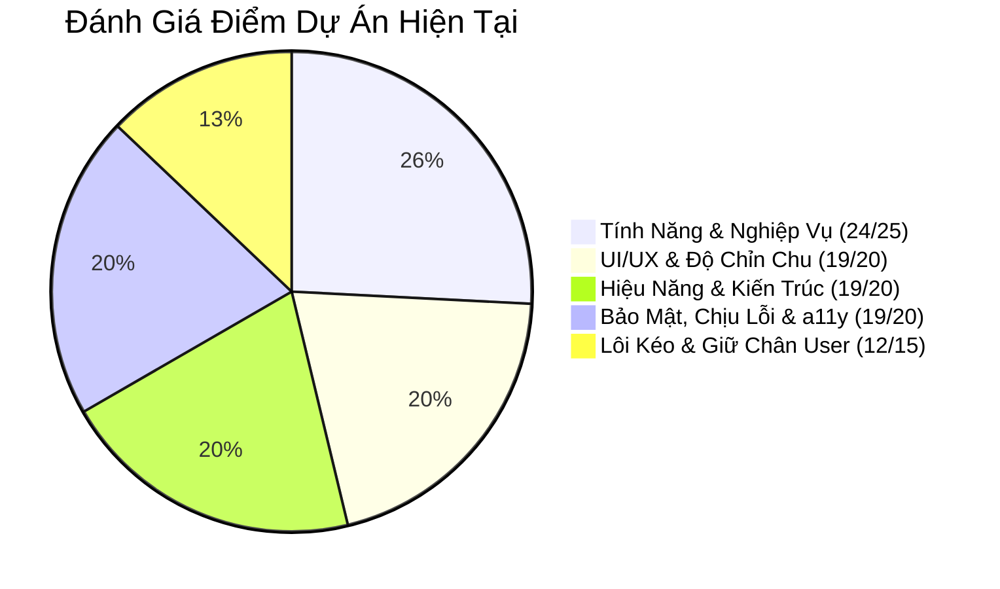

# 📌 BẢNG TỔNG HỢP CÁC ĐIỂM CÒN THIẾU & LỘ TRÌNH NÂNG CẤP DỰ ÁN
> **Dự án:** Student Life Hub  
> **Ngày lập:** 18/09/2026  
> **Cập nhật lần cuối:** 18/09/2026  
> **Mục đích:** Bảng theo dõi cố định (không bị trôi tin nhắn) để kiểm soát chất lượng và hoàn thiện dự án lên chuẩn Production-Grade.

---

## 🎯 THANG ĐIỂM ĐÁNH GIÁ HIỆN TẠI (93/100)



---

## 📋 CHI TIẾT CÁC ĐIỂM CÒN THIẾU CẦN HOÀN THIỆN

### 🔴 1. CÁC LỖI LOGIC NGHIỆP VỤ (ƯU TIÊN SỐ 1 - ĐÃ HOÀN THÀNH 100%)
- [x] **Lỗi 1: Khóa danh mục Thu nhập (`finance.controller.js`)** — *Đã hoàn thành: Đã mở khóa DANH_MUC_THU (lương, học bổng, trợ cấp, thưởng) và đồng bộ dropdown ở giao diện*
- [x] **Lỗi 2: Tính sai điểm GPA môn học dở dang (`grade.util.js`)** — *Đã hoàn thành: Chuẩn hóa tính điểm theo tổng trọng số các cột đã chấm, không kéo tụt GPA nữa*
- [x] **Lỗi 3: Không đổi được môn học của Deadline (`deadline.controller.js`)** — *Đã hoàn thành: Bổ sung idMonHoc vào suaDeadline kèm kiểm tra quyền sở hữu*
- [x] **Lỗi 4: Quên xóa cache tài chính (`TaiChinh.jsx`)** — *Đã hoàn thành: Tự động xóa finance_cache khi thêm/xóa giao dịch*

---

### 🟡 2. TỐI ƯU KIẾN TRÚC MÃ NGUỒN (ARCHITECTURE - ĐÃ HOÀN THÀNH 100%)
- [x] **Backend: Bổ sung tầng Service (`academic.service.js`, `finance.service.js`)** — *Đã hoàn thành: Tách logic tính GPA, cảnh báo điểm, xu hướng, hạn mức ngân sách ra khỏi Controllers*
- [x] **Gom hằng số vào `constants.js` Backend & Frontend** — *Đã hoàn thành: Tập trung toàn bộ hằng số AUTH, FINANCE, ACADEMIC, DEADLINE, THOIKHOABIEU, CHATBOT, RATE_LIMIT*
- [x] **Frontend: Tạo tầng API Service tập trung (`front/src/services/`)**
  - Đã tạo `academicService.js`, `financeService.js`, `deadlineService.js`, `timetableService.js`, `authService.js`, `notificationService.js`.
  - Gom toàn bộ lệnh gọi API, params và endpoint URL vào service layer.
- [x] **Frontend: Tách các file trang quá lớn ("God Components" > 300 - 675 dòng)**
  - `Dashboard.jsx` (580 dòng $\rightarrow$ 157 dòng): Tách `DashboardKpiCards.jsx`, `DashboardWarnings.jsx`, `DashboardRecentLists.jsx`, `DashboardCharts.jsx`.
  - `TaiChinh.jsx` (645 dòng $\rightarrow$ 180 dòng): Tách `FinanceKpiCards.jsx`, `BudgetSection.jsx`, `FinanceTrendChart.jsx`, `TransactionForm.jsx`, `TransactionTable.jsx`.
  - `Deadline.jsx` (675 dòng $\rightarrow$ 180 dòng): Tách `DeadlineForm.jsx`, `DeadlineCalendarView.jsx`, `DeadlineListView.jsx`, `deadlineUtils.js`.
  - `MonHoc.jsx` (599 dòng $\rightarrow$ 180 dòng): Tách `SubjectGpaChart.jsx`, `SubjectForm.jsx`, `SubjectCard.jsx`.
  - `ThoiKhoaBieu.jsx` (475 dòng $\rightarrow$ 170 dòng): Tách `TimetableForm.jsx`, `TimetableGrid.jsx`, `TimetableMobile.jsx`, `timetableUtils.js`.
- [x] **Dọn dẹp code rác**
  - Đã xóa 2 file không sử dụng: `AnimatedNumber.jsx` và `truongNganh.js`.

---

### 🔴 3. KIỂM THỬ TỰ ĐỘNG (AUTOMATED TESTING) — *TIẾP THEO*
- [ ] **Cài đặt thư viện kiểm thử**: `jest`, `supertest` cho backend.
- [ ] **Viết Unit Tests**:
  - Test thuật toán tính điểm GPA và quy đổi thang điểm (`grade.util.test.js`).
  - Test hàm lọc mã độc công thức Excel (`chongCongThuc`).
- [ ] **Viết Integration Tests**:
  - Test API Auth: Đăng ký $\rightarrow$ Đăng nhập $\rightarrow$ Đổi mật khẩu.
  - Test API Môn học & Điểm thành phần.

---

### 🟡 4. VẬN HÀNH & DEVOPS (CONTAINER & CI/CD)
- [ ] **Đóng gói Docker**:
  - Viết `Dockerfile` multi-stage cho Backend và Frontend.
  - Viết `docker-compose.yml` định nghĩa sẵn Postgres + Backend + Frontend (chạy bằng 1 lệnh duy nhất).
- [x] **Tạo Health Check Endpoint** — *Đã hoàn thành: Route GET /api/health kiểm tra kết nối DB và uptime phục vụ Docker / Render*
- [ ] **Cấu hình CI/CD GitHub Actions**:
  - Tạo `.github/workflows/ci.yml` tự động chạy linter, build Vite và test khi push code.
- [ ] **Cài đặt nén HTTP**:
  - Cài `compression` middleware cho Express để nén gzip phản hồi JSON.

---

### 🟢 5. TRẢI NGHIỆM NGƯỜI DÙNG & TÀI LIỆU (UX & DOCUMENTATION)
- [ ] **Tài liệu API Swagger UI**:
  - Tích hợp `swagger-ui-express` để xem và test toàn bộ 30 endpoints tại `/api-docs`.
- [ ] **Chuyển Loading Spinner sang Skeleton Loader**:
  - Tạo khung skeleton nhấp nháy mô phỏng vị trí thẻ khi đang tải dữ liệu.
- [ ] **Hiệu ứng chúc mừng (Gamification)**:
  - Thêm hiệu ứng pháo hoa giấy (Confetti) khi bấm hoàn thành deadline khó.

---

## ⏱️ BẢNG TIẾN ĐỘ THỰC HIỆN
```text
[Giai đoạn 1] Sửa 4 lỗi logic nghiệp vụ + Cache         [ HOÀN THÀNH 100% ]
[Giai đoạn 2] Backend Service Layer + Constants         [ HOÀN THÀNH 100% ]
[Giai đoạn 3] Frontend API Services + Tách Component    [ HOÀN THÀNH 100% ]
[Giai đoạn 4] Docker + Docker Compose + Health Check    [ Kế hoạch tiếp theo ]
[Giai đoạn 5] Unit Tests (Jest / Supertest)             [ Kế hoạch tiếp theo ]
```
