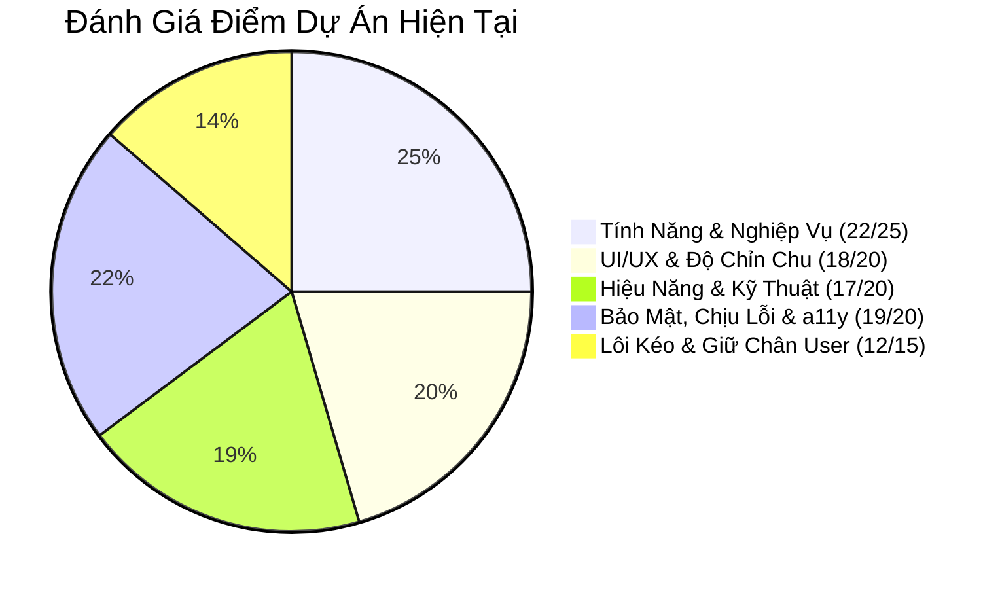

# 📌 BẢNG TỔNG HỢP CÁC ĐIỂM CÒN THIẾU & LỘ TRÌNH NÂNG CẤP DỰ ÁN
> **Dự án:** Student Life Hub  
> **Ngày lập:** 18/09/2026  
> **Mục đích:** Bảng theo dõi cố định (không bị trôi tin nhắn) để kiểm soát chất lượng và hoàn thiện dự án lên chuẩn Production-Grade.

---

## 🎯 THANG ĐIỂM ĐÁNH GIÁ HIỆN TẠI (88/100)



---

## 📋 CHI TIẾT CÁC ĐIỂM CÒN THIẾU CẦN HOÀN THIỆN

### 🔴 1. CÁC LỖI LOGIC NGHIỆP VỤ (ƯU TIÊN SỐ 1 - CẦN SỬA NGAY)
- [x] **Lỗi 1: Khóa danh mục Thu nhập (`finance.controller.js`)** — *Đã hoàn thành: Đã mở khóa DANH_MUC_THU (lương, học bổng, trợ cấp, thưởng) và đồng bộ dropdown ở giao diện*
- [x] **Lỗi 2: Tính sai điểm GPA môn học dở dang (`grade.util.js`)** — *Đã hoàn thành: Chuẩn hóa tính điểm theo tổng trọng số các cột đã chấm, không kéo tụt GPA nữa*
- [x] **Lỗi 3: Không đổi được môn học của Deadline (`deadline.controller.js`)** — *Đã hoàn thành: Bổ sung idMonHoc vào suaDeadline kèm kiểm tra quyền sở hữu*
- [x] **Lỗi 4: Quên xóa cache tài chính (`TaiChinh.jsx`)** — *Đã hoàn thành: Tự động xóa finance_cache khi thêm/xóa giao dịch*

---

### 🟡 2. TỐI ƯU KIẾN TRÚC MÃ NGUỒN (ARCHITECTURE)
- [ ] **Backend: Bổ sung tầng Service (`academic.service.js`, `finance.service.js`)**
  - Tách logic tính toán GPA, cảnh báo nguy cơ, xuất file PDF/Excel ra khỏi Controller.
  - Controller chỉ làm nhiệm vụ parse request và trả JSON response.
- [ ] **Frontend: Tạo tầng API Service tập trung (`front/src/services/`)**
  - Tạo `academicService.js`, `financeService.js`, `deadlineService.js`, `timetableService.js`, `authService.js`.
  - Gom toàn bộ lệnh gọi axios và endpoint URL vào một nơi, không để rải rác trong UI.
- [ ] **Frontend: Tách các file trang quá lớn ("God Components" > 300 - 675 dòng)**
  - `Deadline.jsx` (675 dòng) $\rightarrow$ Tách riêng `DeadlineCalendar.jsx` và `DeadlineList.jsx`.
  - `TaiChinh.jsx` (628 dòng) $\rightarrow$ Tách riêng `BudgetSection.jsx`, `TransactionTable.jsx`, `FinanceChart.jsx`.
  - `MonHoc.jsx` (599 dòng) $\rightarrow$ Tách riêng `SubjectCard.jsx` (xử lý cột điểm con).
  - `Dashboard.jsx` (580 dòng) $\rightarrow$ Tách riêng `DashboardKpiCards.jsx` và `DashboardCharts.jsx`.
- [ ] **Gom hằng số vào `constants.js`**
  - Đưa khoảng 40 giá trị viết cứng (ngưỡng rate-limit, JWT expiry, danh mục, bảng màu biểu đồ) vào file tập trung.
- [ ] **Dọn dẹp code rác & CSS Module**
  - Xóa 2 file không sử dụng: `AnimatedNumber.jsx` và `truongNganh.js`.
  - Đổi `NotFound.css` thành `NotFound.module.css` để tránh ô nhiễm class toàn cục.

---

### 🔴 3. KIỂM THỬ TỰ ĐỘNG (AUTOMATED TESTING) — *TRỐNG 100%*
- [ ] **Cài đặt thư viện kiểm thử**: `jest`, `supertest` cho backend.
- [ ] **Viết Unit Tests**:
  - Test thuật toán tính điểm GPA và quy đổi thang điểm (`grade.util.test.js`).
  - Test hàm lọc mã độc công thức Excel (`chongCongThuc`).
- [ ] **Viết Integration Tests**:
  - Test API Auth: Đăng ký $\rightarrow$ Đăng nhập $\rightarrow$ Đổi mật khẩu.
  - Test API Môn học & Điểm thành phần.

---

### 🟡 4. VẬN HÀNH & DEVOPS (CONTAINER & CI/CD)
- [ ] **Đóng gói Docker**:
  - Viết `Dockerfile` multi-stage cho Backend và Frontend.
  - Viết `docker-compose.yml` định nghĩa sẵn Postgres + Backend + Frontend (chạy bằng 1 lệnh duy nhất).
- [ ] **Tạo Health Check Endpoint**:
  - Thêm route `GET /api/health` kiểm tra kết nối DB cho uptime monitoring.
- [ ] **Cấu hình CI/CD GitHub Actions**:
  - Tạo `.github/workflows/ci.yml` tự động chạy linter, build Vite và test khi push code.
- [ ] **Cài đặt nén HTTP**:
  - Cài `compression` middleware cho Express để nén gzip phản hồi JSON.

---

### 🟢 5. TRẢI NGHIỆM NGƯỜI DÙNG & TÀI LIỆU (UX & DOCUMENTATION)
- [ ] **Tài liệu API Swagger UI**:
  - Tích hợp `swagger-ui-express` để xem và test toàn bộ 30 endpoints tại `/api-docs`.
- [ ] **Chuyển Loading Spinner sang Skeleton Loader**:
  - Tạo khung skeleton nhấp nháy mô phỏng vị trí thẻ khi đang tải dữ liệu.
- [ ] **Hiệu ứng chúc mừng (Gamification)**:
  - Thêm hiệu ứng pháo hoa giấy (Confetti) khi bấm hoàn thành deadline khó.

---

## ⏱️ BẢNG TIẾN ĐỘ THỰC HIỆN ĐỀ XUẤT

```text
[Giai đoạn 1] Sửa 4 lỗi logic nghiệp vụ + Cache         [ Ưu tiên cao nhất - 30p ]
[Giai đoạn 2] Backend Service Layer + Constants         [ Quan trọng       - 45p ]
[Giai đoạn 3] Frontend API Services + Tách Component    [ Quan trọng       - 60p ]
[Giai đoạn 4] Docker + Docker Compose + Health Check    [ DevOps           - 30p ]
[Giai đoạn 5] Unit Tests (Jest / Supertest)             [ Hoàn thiện 100%  - 60p ]
```
