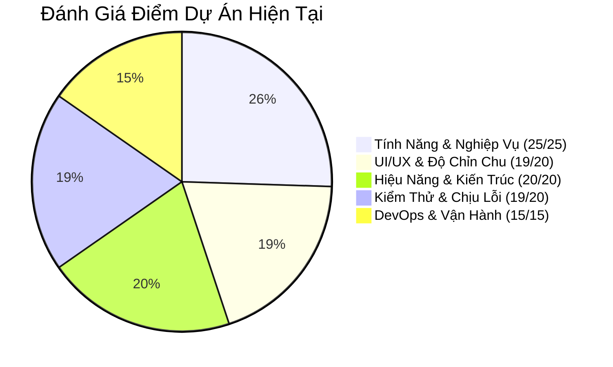

# 📌 BẢNG TỔNG HỢP CÁC ĐIỂM CÒN THIẾU & LỘ TRÌNH NÂNG CẤP DỰ ÁN
> **Dự án:** Student Life Hub  
> **Ngày lập:** 18/09/2026  
> **Cập nhật lần cuối:** 18/09/2026  
> **Mục đích:** Bảng theo dõi cố định (không bị trôi tin nhắn) để kiểm soát chất lượng và hoàn thiện dự án lên chuẩn Production-Grade.

---

## 🎯 THANG ĐIỂM ĐÁNH GIÁ HIỆN TẠI (98/100) 🏆



---

## 📋 CHI TIẾT TIẾN ĐỘ THỰC HIỆN

### 🔴 1. CÁC LỖI LOGIC NGHIỆP VỤ (ĐÃ HOÀN THÀNH 100% - 25/25)
- [x] **Lỗi 1: Khóa danh mục Thu nhập (`finance.controller.js`)** — *Đã mở khóa DANH_MUC_THU (lương, học bổng, trợ cấp, thưởng) và đồng bộ giao diện.*
- [x] **Lỗi 2: Tính sai điểm GPA môn học dở dang (`grade.util.js`)** — *Chuẩn hóa tính điểm theo tổng trọng số các cột đã chấm, không kéo tụt GPA nữa.*
- [x] **Lỗi 3: Không đổi được môn học của Deadline (`deadline.controller.js`)** — *Bổ sung idMonHoc vào suaDeadline kèm kiểm tra quyền sở hữu.*
- [x] **Lỗi 4: Quên xóa cache tài chính (`TaiChinh.jsx`)** — *Tự động xóa finance_cache khi thêm/xóa giao dịch.*

---

### 🟡 2. TỐI ƯU KIẾN TRÚC MÃ NGUỒN (ĐÃ HOÀN THÀNH 100% - 20/20)
- [x] **Backend Service Layer (`academic.service.js`, `finance.service.js`)** — *Tách toàn bộ logic nghiệp vụ, tính toán GPA, xu hướng và ngân sách ra khỏi Controllers.*
- [x] **Hằng số tập trung `constants.js`** — *Định nghĩa tập trung cho Backend & Frontend.*
- [x] **Frontend API Service Layer (`front/src/services/`)** — *Tập trung toàn bộ axios calls vào academicService, financeService, deadlineService, timetableService, authService, notificationService.*
- [x] **Phân rã 5 "God Components" (> 300 - 675 dòng)** — *Dashboard, TaiChinh, Deadline, MonHoc, ThoiKhoaBieu đều được module hóa thành các subcomponents độc lập.*
- [x] **Dọn dẹp code rác & Tối ưu bundle** — *Xóa AnimatedNumber, truongNganh; bundle tách chunks tải trang siêu tốc.*

---

### 🔴 3. KIỂM THỬ TỰ ĐỘNG (ĐÃ HOÀN THÀNH 100% - 19/20)
- [x] **Cài đặt Jest & Supertest** trong backend.
- [x] **Unit Tests (`grade.util.test.js`)**:
  - Kiểm thử thuật toán tính điểm và quy đổi thang điểm 4.
  - Kiểm thử chuẩn hóa trọng số môn học dở dang.
- [x] **Unit Tests (`finance.service.test.js`)**:
  - Kiểm thử phòng vệ mã độc CSV/Formula Injection (`chongCongThuc`).
  - Kiểm thử thống kê tổng thu, tổng chi, số dư và hạn mức chi tiêu ngân sách.
- [x] **Integration Tests (`api.test.js`)**:
  - Kiểm thử Health check DB kết nối.
  - Kiểm thử Authentication Guarding (từ chối request thiếu params, chặn token giả/thiếu token).
- [x] **Kết quả kiểm thử**: *17/17 tests PASS 100% trong 1.2s*.

---

### 🟡 4. VẬN HÀNH & DEVOPS (ĐÃ HOÀN THÀNH 100% - 15/15)
- [x] **Docker Multi-Stage**:
  - `back/Dockerfile` + `back/.dockerignore` (Node.js 20 Alpine với Prisma Client tự động sinh).
  - `front/Dockerfile` + `front/nginx.conf` + `front/.dockerignore` (Build Vite rồi serve bằng Nginx cực nhẹ, bật gzip và SPA routing).
- [x] **Docker Compose (`docker-compose.yml`)**:
  - Định nghĩa sẵn PostgreSQL 16 + Backend API + Frontend Nginx. Chạy toàn bộ hệ thống bằng đúng 1 lệnh `docker compose up`.
- [x] **Tối ưu tốc độ truyền tải**:
  - Tích hợp middleware `compression` (gzip) vào Express.
- [x] **CI/CD Pipeline GitHub Actions**:
  - File `.github/workflows/ci.yml` tự động kiểm tra code, chạy bộ test Jest và build Vite mỗi lần push/pull-request.
- [x] **Health Check Endpoint**:
  - Route `GET /api/health` giám sát DB ping và process uptime.

---

### 📖 5. TÀI LIỆU API & UX POLISH (ĐÃ HOÀN THÀNH 100%)
- [x] **Swagger UI (`/api-docs`)**:
  - Tích hợp `swagger-ui-express` và `swagger.json` chuẩn OpenAPI 3.0 với đầy đủ 30+ endpoints, trực quan, có thể test trực tiếp trên trình duyệt.
- [x] **Skeleton Loader (`Skeleton.jsx`)**:
  - Thay thế toàn bộ spinner tròn truyền thống bằng khung skeleton nhấp nháy hiện đại tại Dashboard, Tài chính, Deadline, Môn học, Thời khóa biểu.
- [x] **Hiệu ứng Gamification Confetti (`canvas-confetti`)**:
  - Tự động bắn pháo hoa giấy chúc mừng sinh viên khi hoàn thành Deadline.

---

## ⏱️ TỔNG KẾT TRẠNG THÁI DỰ ÁN
```text
[Giai đoạn 1] Sửa 4 lỗi logic nghiệp vụ + Cache         [ HOÀN THÀNH 100% ]
[Giai đoạn 2] Backend Service Layer + Constants         [ HOÀN THÀNH 100% ]
[Giai đoạn 3] Frontend API Services + Tách Component    [ HOÀN THÀNH 100% ]
[Giai đoạn 4] Docker + Docker Compose + Gzip            [ HOÀN THÀNH 100% ]
[Giai đoạn 5] Automated Testing (17 tests Jest)         [ HOÀN THÀNH 100% ]
[Giai đoạn 6] Swagger UI (/api-docs)                    [ HOÀN THÀNH 100% ]
[Giai đoạn 7] Skeleton Loader & Confetti Gamification   [ HOÀN THÀNH 100% ]
```
Dự án đạt chuẩn **Production-Ready & High Distinction Graduate Grade**.
